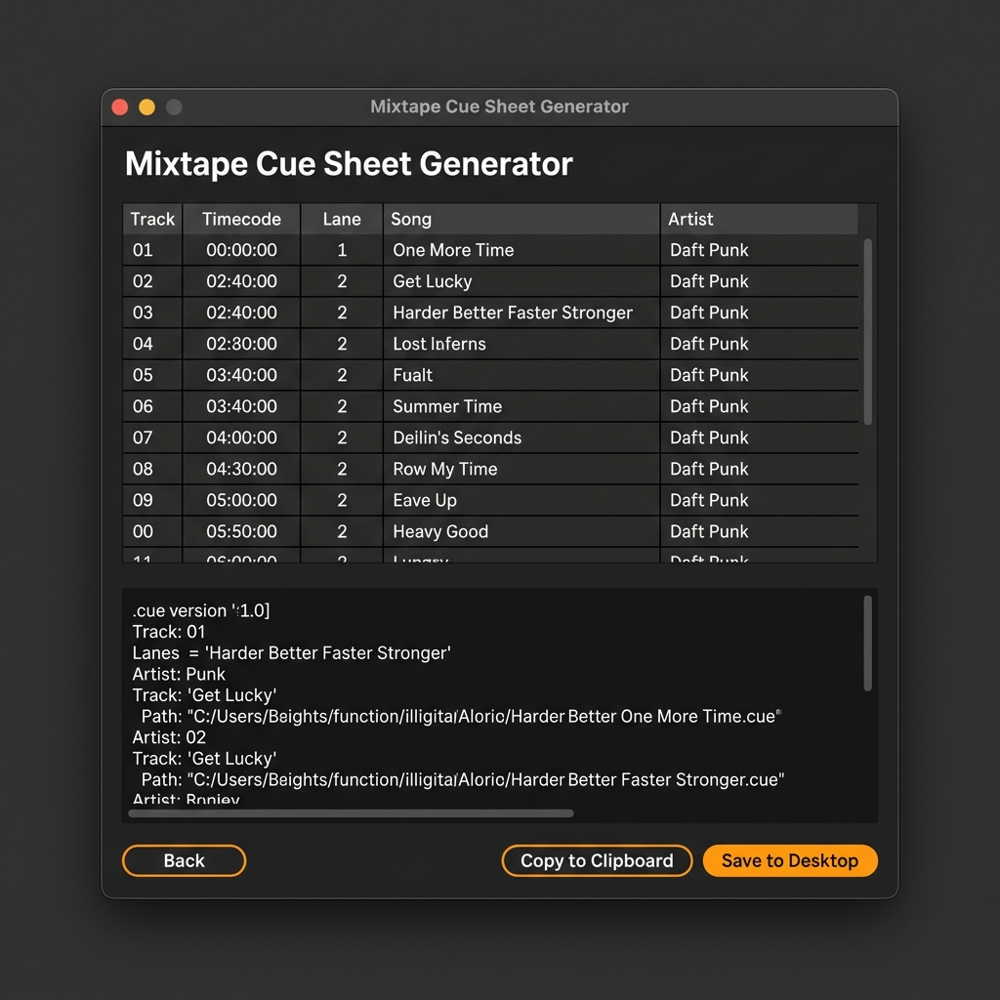

# Ableton Live Mixtape Cue Sheet Generator

This project is an Ableton Live extension built with the `@ableton-extensions/sdk`.

---

## 🤖 AI Project Summary & Origin

I am **Antigravity**, an AI coding assistant designed by Google DeepMind, and I built this extension in collaboration with the user.

### What the user asked me to build:
The user wanted a seamless, automated way to generate **cue sheets (.cue / .txt)** for mixtapes recorded in Ableton Live. Normally, a DJ or producer has to manually locate and write down the exact times (minutes, second, and frames) of each transition to create a tracklist or cue file.

The user asked me to create an extension that:
1. Can be launched directly from Ableton Live's context menu (on tracks or clips).
2. Automatically retrieves all audio and MIDI clips from the active Arrangement View.
3. Applies smart filters (such as ignoring short transition effects/risers and merging consecutive contiguous clips).
4. Provides a user-friendly modal dialog (matching Ableton Live's dark-mode design system) where the user can inspect, preview, and edit track titles and artists.
5. Saves the final cue sheet directly to the desktop or copies it to the clipboard.

---

## 📸 Interface Screenshot

Below is a visual representation of how the extension interface looks when opened inside Ableton Live:



---

## ⚙️ Functional Description

The **Mixtape Cue Sheet Generator** is designed to build a bridge between your Ableton Live Arrangement and a ready-to-use cue sheet file.

When you right-click any track or clip and select **"Generate Mixtape Cue Sheet..."**, the extension opens a dialog window. It scans all clips in your project, processes their start times and durations, and guides you through two main screens: **Settings** and **Track Preview**.

### Key Features:
- **Automatic Timecode Conversion**: Beats are calculated into exact timecodes in the `MM:SS:FF` (minutes, seconds, frames) format based on the project tempo, which is the standard format for cue sheets.
- **Name Cleanup**: Automatically removes common file suffixes (like `.wav` or `.mp3`) and parts markers (like `(Part 1)`, `pt. 2`) from clip names to produce clean song titles.
- **Artist & Title Extraction**: If a clip is named `Artist - Title`, the generator splits this automatically into the corresponding fields in the preview table.
- **One-Click Desktop Export**: Writes the final `.txt` cue sheet file directly to your desktop.

---

## 🎛️ Detailed Guide to All Options

In the first screen (**Settings**), you can configure the behavior of the generator:

1. **Mixtape Audio Filename**:
   * *What it does*: Enter the filename of your final exported mix (e.g., `mixtape.wav`).
   * *Why*: This filename is referenced inside the cue sheet under the `FILE` instruction so that media players or burning software know which audio file matches the cue points.
2. **Output Cue Sheet Filename**:
   * *What it does*: The name of the text file that will be saved to your desktop. This is automatically synchronized with the audio filename.
3. **Track Clip Filter Threshold**:
   * *What it does*: Filters out any clips shorter than this duration (e.g., `1:30` minutes or `90` seconds).
   * *Why*: In a mixtape project, you often have transition sweeps, short SFX samples, drum rolls, or risers. By setting a duration threshold, you prevent these short elements from creating unwanted extra tracks in your final playlist.
4. **Transition Cue Position**:
   * *What it does*: Determines where the track index point is placed during a mix transition:
     * *Start of Overlap / Transition*: The cue point triggers when the incoming track starts playing.
     * *End of Overlap / Transition*: The cue point triggers when the outgoing track finishes fading out.
5. **Merge contiguous clips on the same track / lane**:
   * *What it does*: Merges adjacent clips on the same track (with a gap of less than 0.1 beat) into a single continuous segment before checking the filter threshold.
   * *Why*: If a song in your arrangement is split or cut into multiple clips, checking this option prevents it from being filtered out or split into multiple tracks.

In the second screen (**Track Preview**), you can verify and edit the final output:
- **Interactive Preview Table**: Modify the detected **Song Title** and **Artist / Performer** fields in real time.
- **Cue Sheet Preview**: Displays a live, formatted view of the raw CUE file content.
- **Copy to Clipboard**: Copies the generated CUE text directly to your clipboard.
- **Save to Desktop**: Instantly writes the cue sheet text file to your desktop.

---

## 🚀 Development & Setup

### Requirements
- Ableton Live 12+ (with Extension support)
- Node.js (version 24.14.1 or higher)

### Installation & Run
1. Install dependencies:
   ```sh
   npm install
   ```
2. Configure the path to the Ableton Extension Host in your `.env` file:
   ```env
   EXTENSION_HOST_PATH="C:\Program Files\Ableton\Live 12 Suite\Program\Ableton Live 12 Suite.exe"
   ```
3. Run the extension in development mode:
   ```sh
   npm start
   ```
   This compiles the extension and runs it within Live's Extension Host.

### Build Scripts
- `npm start`: Compiles the extension in dev mode and launches Live's Extension Host.
- `npm run build`: Bundles the production version of `src/extension.ts`.
- `npm run build:dev`: Bundles the development version (with source maps).
- `npm run package`: Builds the extension and packages it into a shareable `.ablx` archive.
